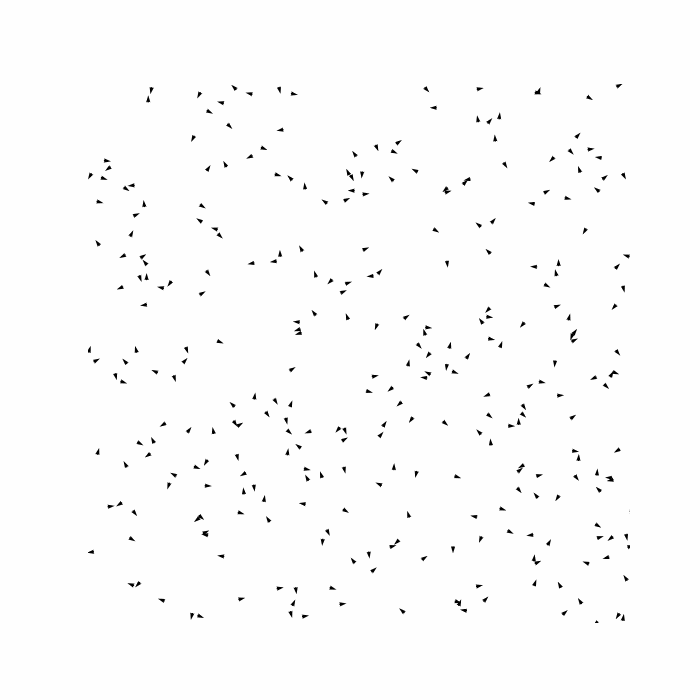

<div align="center">

# :bird: :bird: :bird: What the Flock! :bird: :bird: :bird:

</div>

# Flock simulation
Agent based imulation of Flock dynamic with Python. The scripts contained in this repository allow to simulate the flock behaviour given some basic rules, and visualizes it with an animation. This project also includes unit tests to ensure the correct functionality of the simulation.

# Table of Contents
1. [Installation](#Installation)
2. [Requirements](#Requirements)
3. [Repository structure](#Repository-structure)
4. [Documentation](#Documentation)
5. [Scripts pverview](#Scripts-overview)
6. [Usage and examples](#Usage-and-examples)
7. [Theory background](#Theory-background)

# Installation
To start using the repository, irst clone it:

```
git clone https://github.com/MassimoMario/flock_simulation.git
```

# Requirements
This project requires **Python &ge; 3.8** and the following libraries:
- `numpy`
- `matplotlib`
- `ipython`
- `tqdm`
- `pytest`
- `pytest-cov`

To install them you can run on the Bash:

```
pip install -r requirements.txt
```

# Repository structure
The repository contains the following folders and files:
- [`simulation.py`](simulation.py) is the main script for simulating and animating the flock.
- [`scripts`](scripts) folder containing the flock class, the test script and the utils scripts
  - [`flock_class.py`](scripts/flock_class.py) contains the class Flock definition, where all the simulation computation are described
  - [`test.py`](scripts/test.py) is the unit test scripts made using pytest
  - [`utils.py`](scripts/utils) script contains the animation function and some useful function for the command line interface arguments interpretation
- [`config`](config) folder contains 3 configuration files `.ini` to be used from command line as inputs in `simulation.py` script
- [`requirements.txt`](requirements.txt) file contains the list of dependencies required for the project

# Documentation

# Scripts overview

# Usage and examples
The main script `simulation.py` can be runned from the command line providing different argument ending in different configuration.

## :information_source: Help
For a complete list of parameters and their descriptions, run:

```
python simulation.py --help
```

## :one: Simulate and animate a flock
Example of a simulation with a parameters that produce a good behaviour flock dynamic:

```
python simulation.py --N 300 --separation 11 --alignment 2.35 --coherence 1.1 --visual_range 30 --avoid_range 23 
```



## :two: Provide intial positions and velocities
You can provide initial positions and velocities of N birds:

```
python simulation.py --N 3 --positions_i 1 1 --positions_i 50 50 --positions_i 30 55 --velocities_i 1 1 --velocities_i -5 5 --velocities_i -1.1 -2.3
```
:warning: The previous setup produce an initial position array equal to `[[1,1],[50,50],[30,55]]` and an initial velocity array equal to `[[1,1],[-5,5],[-1.1,-2.3]]`

## :three: Provide a config file
You can provide simulation parameter from a `.ini` config file:

```
python simulation.py --config config/config_good_behaviour.ini
```

## :four: Save the animation
You can save the animation as a GIF:

```
python simulation.py --save True
```
# Theory background
